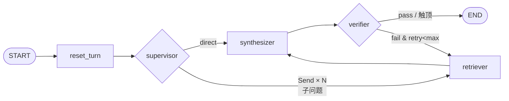

# 企业知识库智能分析 Agent

基于 **LangGraph + MCP + ChromaDB** 的 Supervisor 多 Agent 企业知识库问答系统。

面向「企业内部制度问答」这一强时效、强忠实度场景，三条硬约束：

1. **不编造** —— 检索无结果直接拒答，不调用模型生成。
2. **不错版本** —— 时效过滤下推到向量库与 BM25 两侧，已过期版本零泄漏。
3. **可自纠正** —— 生成后由核查节点逐条比对断言，无依据则改写检索词重检。

---

## 系统架构



- **单路**：`reset_turn → supervisor → retriever → synthesizer → verifier → END`
- **并行**：supervisor 拆出 ≥2 个子问题时返回 `list[Send]`，并发进入 `retriever`，
  落定后汇合到 `synthesizer`（无聚合节点，带 reducer 的通道即汇合点）。
- **重检**：verifier 判 fail 时复用 `retriever`，仅改写 `search_query`。

**进程边界**：FastAPI 主进程不直连向量库，检索经 `MCPToolClient` 提交到后台事件循环
线程，由长驻会话走 stdio 调用 `chroma_server` / `filesystem_server`
（`search_server` 可选）。原因：Chroma 0.5.x 为 SQLite + hnswlib 本地文件，同目录多进程
访问有锁争用风险。**MCP 启动失败不阻止服务启动**，`/health` 报 `degraded`，`/query`
降级为「无参考资料」。

---

## 关键文件

```
app/
├── main.py                    # FastAPI 入口：MCP 生命周期、路由挂载
├── mcp_client.py              # MCP 客户端（长驻会话 + leader/follower 启动）
├── core/                      # config.py 配置单例 · llm.py LLM/Embedding
├── api/routes/                # health / ingest / query（含 SSE）
├── graph/                     # state.py 状态契约 · builder.py · edges.py · nodes/×4
├── mcp_servers/               # chroma / filesystem / search
├── rag/                       # chunker · indexer · retriever（向量+BM25+RRF）· rrf
└── schemas/                   # ingest / query 请求响应模型
data/docs/                     # 知识库源文档（Markdown + YAML front-matter）
data/chroma_db/                # Chroma 持久化目录（派生产物，可重建）
eval/                          # golden_set.json（35 题）· metrics · judge · eval.py
scripts/                       # seed_docs.py（批量导入）· run_eval.sh
tests/                         # 8 个测试模块（226 用例）
```

---

## 快速开始

### 1. 环境

Python **>= 3.11**，一个 OpenAI 兼容的 LLM + Embedding 服务（默认阿里云百炼 DashScope）。
无需 Docker、无需外部数据库。

### 2. 安装

```bash
pip install -e ".[dev]"
```

> LangChain 生态耦合极紧，`pyproject.toml` 中「版本锚点」锁死了 `langchain-core`、
> `langgraph-checkpoint`、`openai` 等间接依赖。升级任意一项前请先跑通全量测试。

### 3. 配置

```bash
cp .env.example .env    # 至少填写 LLM_API_KEY
```

```dotenv
LLM_API_KEY=sk-your-key-here
LLM_MODEL=deepseek-v4-flash
```

`EMBEDDING_API_KEY` 留空时自动复用 `LLM_API_KEY`。字段名契约：`config.py` 字段名（小写）
与 `.env` 变量名（大写）严格一一对应，改字段名等于改 `.env`。

### 4. 索引

```bash
python scripts/seed_docs.py                    # 索引 data/docs/ 全部文件
python scripts/seed_docs.py --skip-unchanged   # 跳过内容 hash 未变的文档
python scripts/seed_docs.py --only <doc_id>    # 调试单篇
python scripts/seed_docs.py --reset            # 清空重建（需输入 yes 确认）
```

支持 `.md` / `.markdown` / `.txt` / `.pdf`。

### 5. 启动与验证

```bash
uvicorn app.main:app --reload --port 8000

curl http://127.0.0.1:8000/health
curl -X POST http://127.0.0.1:8000/query \
  -H 'Content-Type: application/json' \
  -d '{"query":"2026年第三季度新客户签约的返点比例是多少？"}'
```

交互式文档：<http://127.0.0.1:8000/docs>

---

## API

| 端点 | 说明 |
| --- | --- |
| `GET /` | 服务自描述，返回全部端点路径 |
| `GET /health` | 实时 ping 每个 MCP Server（每次真实调 `list_tools()`），非读启动缓存 |
| `POST /ingest` | 文档上传与索引。`files` 留空即索引 `DOCS_DIR` 全部；`force` 默认 `true`；`reset` 清空 collection（危险） |
| `GET /ingest/stats` | 块数、文档数与逐文档清单（含版本、失效日期、块数） |
| `POST /query` | 同步问答，返回完整 JSON |
| `POST /query/stream` | SSE 流式，与 `/query` 共用请求体、图与终态映射函数 |

`/health` 的 `status` 取 `ok` / `degraded`（**非** `unhealthy`）—— 只要进程活着、
`/query` 仍能降级对外服务，整体就不算不健康。

`/query` 请求字段：

| 字段 | 类型 | 默认 | 说明 |
| --- | --- | --- | --- |
| `query` | `string` | 必填 | 1~2000 字 |
| `session_id` | `string?` | `null` | 提供时跨轮保留状态；不提供则退化为一次性匿名会话，不与其它匿名请求串状态 |
| `top_k` | `int?` | `null` | 覆盖 `TOP_K`，1~50 |
| `include_expired` | `bool` | `false` | 是否纳入已过期文档 |
| `with_answer` | `bool` | `true` | 置 `false` 只检索不生成，用于零 LLM 配额地评估检索质量 |

响应关键字段：`answer`、`citations`、`retrieved_chunks`、`route` / `route_reason`、
`sub_queries`、`retrieval_attempts`、`verdict`、`unsupported_claims`、`retry_count`、`error`。

两类「失败」刻意区分：**`answer` 空 + `error` 有值** = 系统故障；
**`answer` 为拒答文案 + `error` 空** = 正常业务结论。

SSE 帧类型：

| 事件 | `data` | 说明 |
| --- | --- | --- |
| `stage` | `{seq, stage, node, msg, ts, elapsed_ms}` | 逐节点推送，`stage` ∈ `routing` / `retrieving` / `synthesizing` / `verifying` |
| `error` | `{node, msg}` | 图级异常，之后仍会补一帧 `final` |
| `final` | 与 `QueryResponse` 同构 | 收尾帧 |

> `stage` 用稳定的对外词汇而非图内部节点名，节点重命名不影响调用方。并行 fan-out 下
> `retrieving` 会出 N 帧，但同一超步内各支是一起到达的（LangGraph 超步落定后统一发出）。

---

## 配置要点

完整列表见 `.env.example`。

**LLM / Embedding**

| 变量 | 默认 | 说明 |
| --- | --- | --- |
| `LLM_API_KEY` | — | **必填** |
| `LLM_MODEL` | `deepseek-v4-flash` | 推理、路由、核查、生成 |
| `LLM_TEMPERATURE` | `0.0` | 路由与核查是判断题 |
| `EMBEDDING_MODEL` | `text-embedding-v4` | 1024 维 |
| `EMBEDDING_BATCH_SIZE` | `10` | text-embedding-v4 单请求上限，超过直接 400，必须分批 |

**检索 / 向量库**

| 变量 | 默认 | 说明 |
| --- | --- | --- |
| `CHROMA_PATH` | `./data/chroma_db` | 相对路径一律相对项目根解析 |
| `CHROMA_COLLECTION` | `enterprise_kb` | 3~63 字符，仅字母数字与 `_`/`-` |
| `TOP_K` | `10` | 每轮检索条数上限 |
| `RRF_K` | `60` | RRF 平滑常数 |
| `DOCS_DIR` | `./data/docs` | 默认文档库目录 |

**Agent 自纠正**

| 变量 | 默认 | 说明 |
| --- | --- | --- |
| `MAX_RETRY` | `3` | 回退重检上限，置 `0` 完全禁用 |
| `VERIFIER_MODEL` | `qwen3.6-flash` | 核查专用模型，留空复用 `LLM_MODEL` |
| `MEMORY_ENABLED` | `true` | `false` 则退回无状态 |

**MCP / 评估**

| 变量 | 默认 | 说明 |
| --- | --- | --- |
| `MCP_ENABLED` | `true` | 置 `false` 退回进程内直连，用于 A/B 对比与故障二分 |
| `MCP_SERVERS` | `chroma,filesystem` | `search` 需外部凭据，默认不启动 |
| `MCP_TIMEOUT` / `MCP_START_TIMEOUT` | `30` / `60` | 单次调用 / 全部 Server 握手总超时 |
| `SEARCH_API_BASE` / `SEARCH_API_KEY` | 空 | 未配置时 `web_search` 返回**显式错误**，不返回空列表冒充「没搜到」 |
| `JUDGE_MODEL` | `deepseek-v4-pro` | LLM-as-judge，留空复用 `LLM_MODEL` |

---

## 文档与切块约定

知识库文档为 **Markdown + YAML front-matter**：

```markdown
---
doc_id: sales_policy_2026q4
doc_title: 2026Q4 销售政策
version: 2026Q4
effective_date: 2026-09-17
expire_date: 2026-12-31
source: confluence
---
```

| 字段 | 必填 | 说明 |
| --- | --- | --- |
| `doc_id` | 是（可由文件名推导） | 文档唯一标识 |
| `version` | **是** | 参与「版本准确率」指标 |
| `effective_date` | **是** | 生效日期 |
| `expire_date` | 否 | 缺省 `9999-12-31`（长期有效哨兵） |
| `doc_title` / `source` | 否 | 缺省取 `doc_id` / `local` |

**切块**：解析 front-matter → 移除 H1 → 按 H2 切分（标题写入 `metadata["heading"]`）
→ 超 `MAX_CHARS=800` 先按 H3 再切，仍超长则滑窗切分（`OVERLAP=80`）。
`chunk_id = f"{doc_id}_p{index}"` 确定性生成，写入用 `upsert`；因块数变少时旧块会残留，
每次写入**先 `delete(where={"doc_id": ...})` 再 upsert**。

**日期写入两份**：ChromaDB 0.5.x 的 `where` 范围运算符（`$gte` / `$lte`）只接受
int / float，传 ISO 字符串会抛 `ValueError`。因此 `effective_date` / `expire_date`
存 ISO 字符串用于展示与比对，`effective_ord` / `expire_ord` 存 `YYYYMMDD` 整数用于过滤。
**所有过滤一律走 `*_ord` 字段。**

> BM25 也要做时效过滤。BM25 在本地内存算、无下推能力，因此构建索引时就按 `expire_ord`
> 过滤语料。若只过滤向量一路，已过期的历史版本会仅从稀疏一路混进结果集，直接导致版本
> 准确率指标失真。

**PDF** 无法携带 front-matter，索引器用「文件名 + 修改日期」合成默认元数据；
扫描件（未抽出文本）明确报错提示需先做 OCR。

---

## 评估体系

```bash
python -m eval.eval --retrieval-only --contrast   # 纯检索档，零 LLM 配额，可进 CI
python -m eval.eval --compare                      # 全量档：检索 + 生成 + judge
scripts/run_eval.sh [quick|full|all]               # 封装脚本
```

> 脚本默认用 `D:/miniconda3/envs/kbagent/python.exe`，可用 `PY=/path/to/python` 覆盖。
> 裸 `python` 会命中系统解释器，那里没装依赖。

**必须分两档**：检索质量与生成质量可独立退化（换 embedding 只影响前者，改 prompt 只影响
后者），混在一档里一旦指标掉了无法归因。

`eval/golden_set.json` 共 **35 题** = 30 有标答 + 5 陷阱题。陷阱题考察时效与版本区分，
正确行为是**拒答**；其 `relevant_chunk_ids` 为空数组，Hit@3 记 `None` 而非 0
（把不适用算成 0 会拖垮均值并掩盖真实退化）。

**指标**：检索类含 `Hit@3`、`MRR`、`版本准确率`、`过期版本泄漏`（启用过滤时必须恒为 0，
硬不变量）；生成类含 `拒答率(严格/纯文本/judge 语义)`、`忠实度`、`引用准确率`。
拒答率三轨并报，真值被上下界夹住，背离的题进入 `refusal_diagnostics` 争议清单。

**最新结果**（检索档 2026-09-17 采集；生成档仍为 2026-09-16 的扩容前记录，待重跑）：

| 指标 | 值 |
| --- | --- |
| Hit@3 / MRR / 版本准确率 | **1.0000** / **0.9500** / **0.9333**（n=30） |
| 过期版本泄漏 | **0** 块 / 0 题 |
| 拒答率（judge 语义） | **1.00**（n=5，扩容前语料） |
| 忠实度 / 引用准确率 | **1.00** / **1.00**（扩容前语料） |
| 无依据断言总数 | 0（扩容前语料） |

语料：30 篇文档 / 144 块，其中有效 128 块、过期 16 块（过期版本：`2025`、`2026Q1`、`2026Q2`、`2026Q3`）。

**指标回落与归因**：语料由 5 篇扩至 29 篇后，MRR 由 0.9833 降至 0.9500、版本准确率由 1.00 降至
0.9333。逐题定位确认退化只出现在 `q3` 与 `n30`，成因同一：新增的
`fund_payment_approval_policy`「审批权限」小节与这两题的提问形态高度同构（都是一串按金额
分档的审批阈值）。这不是回归缺陷，而是原 5 篇语料无法暴露的干扰项 —— 原满分有相当程度来自
语料规模过小。两项仍在护栏内（`mrr ≥ 0.90`、`version_accuracy ≥ 0.90`），余量 0.05 与 0.0333。

**季度滚动（2026-09-17）**：原 `expires_on=2026-09-30` 的窗口在 13 天后会让全部销售类题失效，
故新增 `sales_policy_2026q4` 并把 10 道题迁至 `2026Q4`。

首轮迁移把 Q3 留在有效集里，实测**版本准确率跌至 0.4000、MRR 0.6583**：6/10 题的 top-1 落在
Q3 的同名小节上。根因不是参数问题 —— 两份政策多数句子逐字相同、仅数值不同，检索器没有任何
依据偏向后发布者。改为让 Q3 与 Q4 的有效期**首尾相接而不重叠**后，指标恢复至与滚动前完全持平。
该约束已写进 `validity_window.rollover_note`，下一次滚动到 2027Q1 时必须沿用。

**时效过滤的独立贡献**（同题同算法，只切换 `expire_ord` 过滤）：

| 指标 | 启用过滤 | 关闭过滤 |
| --- | --- | --- |
| Hit@3 | **1.0000** | 0.8667 |
| MRR | **0.9500** | 0.7954 |
| 版本准确率 | **0.9333** | 0.7333 |
| 过期版本泄漏 | **0** 块 / 0 题 | **82** 块 / 17 题 |

关闭过滤后 9 题的 top-1 直接落到过期版本（`q1`→Q1、`q2`/`n07`→Q2、`n09`/`n11`→Q1、`n10`→Q3，
三道陷阱题 `t1`-`t3` 更是全部命中 Q3，即典型的「就近作答」）。滚动让这一步的对照比之前更硬：
Q3 与 Q4 正文几乎逐字相同，语义相似度对两者不可分，**只有元数据过滤能区分** —— 这直接证明
该过滤不是过度设计。

**回归护栏** `tests/test_regression.py`：离线可执行（不跑图、不联网、不访问 Chroma），
断言 `FLOORS` 指标下限、**时间窗双向守护**（正常题引用的文档未过期 + 陷阱题依赖的文档
确实过期）、以及 golden set 中每个 `relevant_chunk_id` 存在于现场语料。

---

## 测试

```bash
pytest                                  # 全量
pytest tests/test_chunker.py tests/test_rrf.py tests/test_eval.py   # 不依赖外网的纯函数用例
```

`asyncio_mode = "auto"`，`testpaths = ["tests"]`。8 个模块：`test_chunker`、`test_rrf`、
`test_config`、`test_eval`、`test_graph_nodes`、`test_mcp_servers`、`test_api`、
`test_regression`。共 **226 个用例**。

> 图节点全部支持注入替身（`llm` / `supervisor_llm` / `verifier_llm` / `retriever` /
> `mcp` / `max_retry` / `checkpointer`），因此全部分支含降级路径都能在不打网络、
> 不 spawn 子进程的前提下覆盖。生产路径一律传 `None`，节点内部取进程内单例。

---

## 关键设计取舍

- **`retriever` 不感知自纠正循环**：首检与补检的差别只有检索词，而检索词由 `search_query`
  承载，故回退只需复用同一节点。`Send` 并行分派对节点同样透明 —— 它只认一个字段。
  收益：新增能力只改状态契约与路由函数，节点实现几乎零改动。
- **`retry_count` 在 `retriever` 递增而非 `verifier`**：该字段随响应暴露，语义必须是
  「实际已执行的回退次数」。verifier 只提建议，是否采纳由 `edges.route_after_verifier`
  按 `max_retry` 裁定；在 verifier 递增会导致 `max_retry=0` 时出现「回退 0 次却记 1 次」。
  另：路由函数必须是纯函数 —— 实测条件边在 fan-out 时每个分支各被调用一次。
- **并行分支必须写 reducer 通道**：实测 langgraph 0.2.60 下 N 个分支同写普通通道会抛
  `InvalidUpdateError`。故 `retrieval_attempts` / `retry_count` / `error` 升级为 reducer
  通道（取最大轮次、保留首个错误）。把「能不能并发」从节点逻辑挪进状态契约。
- **MCP 客户端长驻会话**：每次新建 stdio 连接 ~750 ms，长驻会话 ~4 ms，差距约 **150 倍**。
  主线程经 `run_coroutine_threadsafe(...).result(timeout)` 提交，后台线程跑专用事件循环。
- **`start()` 用显式 leader/follower**：`Send` fan-out 后 N 个分支同时落到惰性启动路径，
  而「是否已启动」不能用 `running` 判定（`running` 依赖后台线程创建的 `_loop`，握手完成前
  恒为 `False`），旧实现下并发调用者会各自重清状态、`_pending` 计数错乱，导致复合问题
  整体降级。修法：持锁期间首个调用者为 leader 真正启动，其余只等同一个 `_ready`；
  对外以 `ready`（`running` 且握手落定）作为唯一判据。

### MCP Server 四条硬约束

修改 `app/mcp_servers/*.py` 前**必须**先读对应模块 docstring：

1. **禁止 `from __future__ import annotations`** —— mcp 1.9.2 的 `Tool.from_function` 对
   注解直接调 `issubclass()`，注解被延迟成字符串会抛 `TypeError`，报错完全不指向真因，
   表现为「子进程启动即退出 + Connection closed」。
2. **禁止向 stdout 输出** —— stdio 下 stdout 被 JSON-RPC 独占，一行 `print` 即破坏握手。
   Server 进程不做任何日志或调试输出（本项目已整体移除日志链路）。
3. **工具函数内部不得执行「首次 import」** —— 实测会因全局 import lock 与事件循环线程
   互锁而**永久挂起**。所有 `app.rag.*` 的 import 必须在模块顶层，重初始化放 `warmup()`。
4. **检索器必须是模块级单例** —— Server 进程长驻，单例让 Chroma 连接与 BM25 语料缓存
   跨调用复用；每调用重建会每次多付数百毫秒。

---

## 已知边界

**时间敏感性**：`data/docs/` 的销售政策按季度滚动。当前 `sales_policy_2026q4` **有效期至
2026-12-31**，之后销售类题目标答不可检索，`tests/test_regression.py` 会直接失败并给出提示。
滚动步骤已固化在 `golden_set.json` 的 `validity_window.rollover_note`：新增下一季度政策文档 →
迁移相关题目的 `relevant_chunk_ids` 与 `required_doc_versions` → 同步 `corpus` 计数，且
**新版本的有效期必须与上一版首尾相接而不重叠** —— 2026-09-17 那次滚动踩过这个坑：两个季度的
正文几乎逐字相同，共存时版本准确率会掉到 0.40。

**与蓝图的偏差**：`POST /query` 保持 JSON 并另增 `/query/stream`（蓝图要求 `/query` 本身
改为 SSE）。理由：评估脚本与 `with_answer=false` 的检索评测依赖一次性拿到完整 JSON。
两端点共用同一个 `_build_response`，终态映射只有一份实现，两种表示不可能漂移。

| 运行期边界 | 现状 | 上线前需要 |
| --- | --- | --- |
| 会话持久化 | `MemorySaver` 仅存进程内存，重启即清空 | 换 `SqliteSaver` / `PostgresSaver` |
| 会话内存回收 | 不淘汰旧线程，长跑进程持续占用内存 | 按 session 加 TTL 清理 |
| 多副本部署 | checkpointer 为进程级单例，副本间会话不共享 | 换共享存储型 checkpointer |
| 向量库并发 | Chroma 0.5.x 本地文件，同目录多进程有锁争用风险 | 单副本部署，或换服务化向量库 |
| 外部搜索 | 凭据未配置，`web_search` 显式返回「未启用」 | 配置外部检索服务凭据 |
| 语料规模 | 30 篇 / 144 块（有效 128、过期 16）；`MAX_CHARS=800` 原按 5 篇语料推算 | 复核 top_k 召回内容对 prompt 预算的占用 |

**刻意不做流量追踪**：`config.py` 启动时强制摘除 LangSmith 相关环境变量（共 9 个）。
原因是 `langchain-core` 直接读 `os.environ` 而非本项目 settings —— 若机器上因其它项目
留有 `LANGCHAIN_TRACING_V2=true`，LangChain 会把每次图执行（**含检索到的文档正文与用户
原始问题**）上传，既是数据外泄面，也给每次调用叠加同步网络开销。

---

## 排错

| 现象 | 处理 |
| --- | --- |
| MCP 未就绪、检索降级 | 查 `/health` 的 `checks` 与 `mcp_tools` → 确认以**项目根**为 cwd 启动 → 确认 `sys.executable` 环境含依赖 → 临时 `MCP_ENABLED=false` 二分定位 |
| `Embedding 维度不符` | Chroma 维度首次写入即锁定。换过 `EMBEDDING_MODEL` 必须 `rm -rf data/chroma_db && python scripts/seed_docs.py` |
| Embedding 请求 400 | 查 `EMBEDDING_BATCH_SIZE` 是否 > 10、模型名与 `EMBEDDING_DIM` 是否正确 |
| 业务问题被判 `direct` | supervisor 有硬闸门：LLM 判 direct 但规则层命中 `KB_HINTS` 会强制改判 retrieve。应扩充 `META_PATTERNS` / 调整 `KB_HINTS`，不要放开闸门 |
| `invoke({})` 报 `InvalidUpdateError` | 空字典让 `__start__` 无通道可写。统一用 `initial_state(...)` 构造入参 |

---

## 版本锚点

LangChain 生态耦合极紧，以下间接依赖在 `pyproject.toml` 中锁死：

| 包 | 版本 | 锁定原因 |
| --- | --- | --- |
| `langgraph` | 0.2.60 | `Send` 语义、`astream` stream_mode 行为基准 |
| `langchain-core` | 0.3.63 | 结构化输出与消息协议基准 |
| `langgraph-checkpoint` | 2.1.2 | `MemorySaver` 跨轮保留行为 |
| `chromadb` | 0.5.23 | `hnsw:space` 与 `where` 操作数类型约束 |
| `mcp` | 1.9.2 | 四条硬约束均由该版本实测得出 |
| `openai` | 1.109.1 | Embedding 分批与 `dimensions` 参数 |
| `numpy` | 1.26.4 | 与 `chroma-hnswlib` / `onnxruntime` 的 ABI 兼容 |
| `starlette` | `>=0.40,<0.42` | FastAPI 0.115.6 的 SSE 响应行为 |

---

## 许可

个人项目
