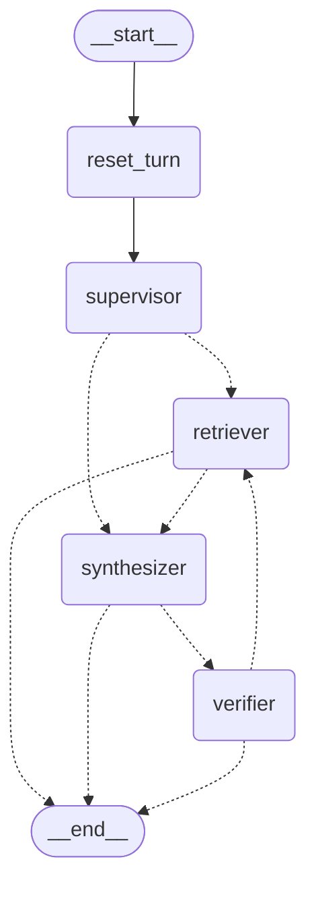

# 企业知识库智能分析 Agent

基于 **LangGraph + MCP + ChromaDB** 的 Supervisor 多 Agent 企业知识库问答系统。
目标不是「能答」，而是**答得可核查**：每个结论必须能追溯到知识库中的具体片段，
同一制度存在多版本时只采用当前有效的版本，且答案本身会被逐句核查、不通过则回退重检。

当前进度：**阶段 5 / 8**（Supervisor 多 Agent 路由）。

---

## 架构

### 问答图（LangGraph）

下图由 `app/graph/builder.py::graph_mermaid()` 直接生成，是图结构的唯一事实来源：



| 节点 | 职责 | 关键实现 |
|---|---|---|
| `reset_turn` | 每轮入口清零累加字段（`events` / `retrieved_chunks` / `unsupported_claims` / `sub_queries`） | 挂 checkpointer 后累加字段会跨轮保留，必须显式清零；带 reducer 的通道用 `None` 清零 |
| `supervisor` | LLM 驱动的路由与拆解：判走检索还是直接生成，复合问题拆成多个子问题 | 结构化输出走 `json_schema`；`decide_route` 规则函数退居兜底与**硬闸门** |
| `retriever` | 混合检索（阶段 4 起改为 MCP 工具调用） | 只认 `search_query` 一个字段，既不感知自纠正循环，也不感知 fan-out |
| `synthesizer` | 生成答案并绑定引用 | 引用按 `chunk_id` 确定性格式提取，模型编造的 id 被丢弃 |
| `verifier` | 逐句核查忠实度，判失败则重组检索词准备重检 | 结构化输出走 `json_schema`；失败时 fail-open |

| 条件分支 | 判定 | 走向 |
|---|---|---|
| `supervisor → ?` | 子问题 ≥ 2（复合问题） | `list[Send]` → N 个 `retriever` **并发**，结果由 reducer 通道汇合 |
| `supervisor → ?` | `route == "retrieve"` 且子问题 < 2 | `retriever` |
| `supervisor → ?` | `route == "direct"`（寒暄/元问题） | `synthesizer`（无参考资料，禁止编造） |
| `supervisor → ?` | `with_answer == false`（评估模式） | `retriever` |
| `retriever → ?` | `with_answer == true` | `synthesizer` |
| `retriever → ?` | `with_answer == false` | `__end__`（只测检索、不花 LLM 配额） |
| `synthesizer → ?` | 有召回块且生成成功 | `verifier` |
| `synthesizer → ?` | `direct` / 无召回块 / 生成失败 | `__end__`（无事实性断言可核查） |
| `verifier → ?` | `verdict == "fail"` 且 `retry_count < MAX_RETRY` | `retriever`（**回退重检**；回退不走并发） |
| `verifier → ?` | 其余 | `__end__` |

---

## Supervisor 多 Agent 路由（阶段 5）

阶段 5 把阶段 2 的规则 Router 升级为 **LLM 驱动的 Supervisor**，并让复合问题
**并行检索**。**图结构一字未改** —— 节点集合与边与阶段 2 完全一致
（`graph_mermaid()` 输出逐字相同），所有变化都发生在「节点内部」与「状态契约」两处。

### 路由决策：LLM 为主，规则当闸门

三层兜底逐层下沉：`结构化输出（json_schema）` → `文本 JSON 解析` → `阶段 2 的规则路由`。
任何一层失败都退回下一层，因此**永远有一个确定的结论**，不存在「路由不出来」的中间态。

| 层 | 作用 |
|---|---|
| 结构化输出 `json_schema` | 主路径：判 `intent`（`retrieve` / `direct`）+ 拆 `sub_queries` |
| 文本 JSON 兜底 | 结构化通道调用失败时，让模型直接吐 JSON |
| `decide_route` 规则 | 最终兜底，同时兼任下面这条硬闸门的判据 |

**硬闸门是刻意不对称的**：

- LLM 判 `direct`，但问题命中 `KB_HINTS` 业务关键词 → **强制改判 `retrieve`**。
  宁可多跑一次检索（几十毫秒），也不能让制度类问题绕过知识库由模型自由发挥。
- LLM 判 `retrieve` → **听 LLM**。规则里「长度 ≤3 字即寒暄」只是没有模型时的启发式，
  拿它去否决模型会误杀「Q2 呢？」这类依赖多轮语境的真问题。

`with_answer=false`（评估模式）时**完全不调 LLM**，直接走规则路由 —— 阶段 2 立下的
「评估不消耗 LLM 配额」契约不能被阶段 5 破掉。

### 并行检索：`Send` + reducer 通道

`route_after_supervisor` 在子问题 ≥ 2 时返回 `list[Send]`，LangGraph 据此把**每个
子问题**投递给一次独立的 `retriever` 执行；下游 `synthesizer` 只执行一次，
并在 reducer 通道里看到全部并发分支的合并结果。

**核心取舍：并发安全性做进了「状态契约」，而不是「节点逻辑」。** `retriever` 节点里
没有任何并发特判，它照旧只返回「本分支的增量」；能否并发由通道的 reducer 决定：

| 通道 | reducer | 语义 |
|---|---|---|
| `retrieved_chunks` | `append_chunks` | 按 `chunk_id` 去重合并；`None` = 清零 |
| `events` / `unsupported_claims` / `sub_queries` | `append_or_reset` | 追加；`None` = 清零 |
| `retrieval_attempts` / `retry_count` | `keep_max` | 取最大轮次（各支都报 1，合并后仍是 1） |
| `error` | `merge_error` | 保留首个非空错误 |

**为什么必须有 reducer**：LangGraph 对**无 reducer 的通道**在并行分支下会抛
`InvalidUpdateError: At key 'X': Can receive only one value per step`。
这是探针实测出来的 —— 最初只有 `error` 是裸 `str`，三个分支一起写就炸。

`Send` 的另一个易错点：**payload 是整体替换而非合并**。分支只拥有被显式传入的字段，
因此 `edges.build_fanout_payload` 必须把 `query` / `search_query` / `top_k` /
`include_expired` / 已有 `retrieved_chunks` 等一并搬运，否则分支会以「空状态」进入、
静默降级为「没有检索词」。

跨支去重放在 reducer 而不是节点，是因为 **reducer 是所有分支唯一的汇聚点**：
两条子问题完全可能命中同一个块（「Q2 返点比例」与「Q2 相比 Q1 的变化」都会召回
Q2 政策正文），不在汇合处去重，同一份证据会以两份身份进入 prompt 与 `citations`。

### 多轮会话：MemorySaver + 每轮清零

挂上 `MemorySaver` 后 `thread_id` 即会话 id，同一会话第二轮能读到上一轮的 checkpoint。
累加字段因此会跨轮保留（实测第二轮 `events` 会变成上一轮的两倍），`reset_turn` 在每轮
入口把它们清零，且**必须用 `None` 而不是 `[]` / `0`** —— reducer 通道里 `None` 是
「reset」信号，直接回退初始值；用空列表会被当成「追加一个空列表」，残留照旧。

请求未带 `session_id` 时，服务端生成一个 uuid 作 thread_id，避免匿名请求互相串话。
`MEMORY_ENABLED=false` 时图不挂 checkpointer，退回阶段 4 的无状态行为。

### 并发暴露出的 MCP 启动竞态（本阶段最值钱的收获）

阶段 4 的 `MCPToolClient` 用 `running` 判断「是否已启动」。而 `running` 依赖 `_loop`，
`_loop` 是**后台线程内部创建**的 —— 握手完成前它一直是 `False`。阶段 4 只有单线程
调用，这个缺陷不会显形；阶段 5 引入 fan-out 后，N 个检索分支同时落到惰性启动路径，
每个分支都判定「尚未启动」，依次进入 `_start_lock` 把 `_tool_index` 清空并**另起一个
事件循环**，`_pending` 计数随之错乱。真实链路的日志时间线：

```
12:50:54  filesystem 已连接（list_docs / read_file 进路由表）
12:50:54  fan-out 分支开始调用 search_documents   ← 尚未注册！
12:50:57  chroma 才连接（search_documents 进路由表）
```

复合问题因此整体降级为「根据现有资料无法确认」。修法是显式的 **leader/follower**：
`start()` 持锁期间的第一个调用者成为 leader 并真正启动，其余调用者只等**同一个**
`_ready` 事件，绝不重入清理共享状态；同时新增 `ready` 属性（`running` **且** 握手
已落定）作为「可以调用工具了」的唯一判据 —— 惰性兜底路径也因此从判 `running` 改为判
`ready`。

> 值得记下的是这个缺陷**由真实链路验证（而非单测）抓到**：单测里 retriever 注入替身，
> 根本不会并发走到 MCP 启动路径。探针先行 → 落盘 → 真实组件复验，是本项目固定下来的三步。
> 回归用例 `test_concurrent_start_is_not_reentrant` 用替身把「握手窗口」拉长后断言
> 「后台线程只被启动一次」；该断言对旧实现必然失败（实测旧逻辑启动 3 个线程）。

### 阶段 5 验收（真实链路，9/9）

全部走真实组件：真实 LLM 路由与拆解、真实 MCP 子进程检索、真实 Chroma 语料、
MemorySaver 真实挂载。

| 验收项 | 结果 |
|---|---|
| 复合问题被拆解 | `sub_queries` = 2 条（Q1→Q2 变化 / 对华东区返点的影响） |
| 多路结果被合并 | 两路各召回 10 块 → 去重合并后 11 块 |
| 答案与引用绑定 | `verdict=pass`（该题语料只有 Q3 版，如实拒答亦为正确行为） |
| 跨轮未污染 | 同 thread 第二轮 vs「同问题全新 thread」召回集合**逐一致**（对称差为空） |
| 跨轮未累加 | 第二轮 10 块 ≤ `top_k`；若清零失效必然超标 |
| 路由边界 | 寒暄 → `direct`；事实型问题 → `retrieve` 且真召回 |
| 无节点级错误 | 五轮均无 `error` |

> 「跨轮未污染」的判据设计过一次修正：v1 写成「两轮 chunk 无交集」是**错的** ——
> 语料只有 3 篇文档，而两轮都在问同一套销售政策，命中重叠是必然的。正确做法是
> **对照实验**：把同一追问放到全新 thread 再跑一遍，两轮召回集合必须一致
> （检索是确定性的：embedding + BM25 + RRF 均无随机性）。判据写错会让人误以为产品有 bug。

---

## MCP 工具层（阶段 4）

**阶段 4 没有改动图结构** —— 这正是阶段 2 把流程图定型的价值：MCP 只替换了
`retriever` 节点的内部实现，节点名、边、状态契约全部不变。

```
                  ┌──────────────── 主进程（推理层）─────────────────┐
                  │  LangGraph：supervisor → retriever → …          │
                  │                    │                            │
                  │        app/mcp_client.py  MCPToolClient          │
                  │        后台事件循环 + 每 Server 长驻会话           │
                  └────────────────────┼────────────────────────────┘
                                       │ JSON-RPC over stdio
            ┌──────────────────────────┼──────────────────────────┐
            ▼                          ▼                          ▼
  chroma_server 子进程        filesystem_server 子进程     search_server 子进程
  search_documents            list_docs / read_file        web_search（可选）
  collection_stats
```

### 暴露的工具

| Server | 工具 | 说明 |
|---|---|---|
| `chroma_server` | `search_documents(query, top_k, include_expired)` | 向量 + BM25 混合检索（RRF 融合）。**不实现任何算法**，只把 `HybridRetriever` 原样暴露 —— 剥离的是进程边界，不是逻辑，因此阶段 1 的 Hit@3 / MRR 结论对其依然成立 |
| `chroma_server` | `collection_stats()` | 索引统计，供健康检查与启动探测 |
| `filesystem_server` | `list_docs()` | 文档清单（含版本与时效元数据） |
| `filesystem_server` | `read_file(filename)` | 单篇全文。**入参视为不可信输入**：先 `resolve()` 再校验是否落在 `DOCS_DIR` 内，可同时挡住 `../` 穿越、绝对路径越界与符号链接逃逸；后缀走白名单 |
| `search_server` | `web_search(query, max_results)` | 可选。未配置 `SEARCH_API_BASE` 时返回**显式**错误，绝不返回空列表冒充「没搜到」 |

启动时用 `list_tools()` 动态发现工具并建立「工具名 → Server」路由表，
结果落盘到 `logs/mcp_tools.json` 供人工核查。

### 连接模型：为什么是长驻会话

同步的 `retriever` 节点要调用异步的 MCP 工具，实测比较了两条路：

| 方案 | 每次调用耗时 |
|---|---|
| 每次调用新建 stdio 连接（spawn 子进程） | **~750 ms** |
| 专用后台事件循环 + 每 Server 长驻会话 | **~4 ms** |

差距约 **150 倍**，且自纠正循环一轮问答最多触发 3 次检索。因此采用后者：
后台线程跑一个专用事件循环，每个 Server 一个长驻协程挂在 stop event 上，
同步侧通过 `run_coroutine_threadsafe().result()` 调用。

**跨进程的实际开销（实测）**：MCP 通道 337 ms vs 进程内直连 299 ms，**约 +38 ms**。
因为两侧都必须调用一次 embedding 接口，该网络耗时占绝对主导，JSON-RPC 编解码
与跨进程传输的占比很小 —— 这也说明「工具层解耦」的代价是可控的。

### 五条硬约束（均为实测结论）

1. **MCP Server 脚本不能写 `from __future__ import annotations`**。
   mcp 1.9.2 的 `Tool.from_function` 对参数注解直接调用 `issubclass()`，
   注解被延迟成字符串会抛 `TypeError: issubclass() arg 1 must be a class`。
   该报错完全不指向真因（表现为「子进程启动即退出 + 客户端只看到 Connection closed」）。

2. **MCP Server 不能向 stdout 输出**。stdio 传输下 stdout 是 JSON-RPC 独占通道，
   一行 `print` 就会破坏握手。日志必须走 stderr（`setup_mcp_logging()`）。

3. **工具函数内部不得执行「首次 import」** —— 本项目最隐蔽的一个坑。
   实测：一个只在工具函数里 `importlib.import_module(...)` 的探针 Server，
   该调用**永久挂起**（180 s 超时也不返回）；同一探针中纯返回、同步
   `time.sleep(2)`、同步 HTTP 请求、stderr 日志**全部正常**。
   机制是 import 需要获取全局 import lock，与事件循环线程互锁形成死锁。
   表现极具误导性：**首次调用挂起、第二次起正常**，极易被误判为「首次连接慢」。
   因此 Server 侧把 `app.rag.*` 全部 import 提到模块顶层，并在 `mcp.run()` 之前
   用 `warmup()` 完成初始化 —— 那时还是单线程，不存在锁竞争。

4. **`start()` 必须等全部 Server 落定才返回**。若第一个 Server 就绪即放行，
   「启动后立即调用」会拿到「工具未注册」—— 实测就是这样丢掉了 filesystem 的
   `list_docs` / `read_file`。用 `_pending` 计数实现。

5. **`start()` 必须并发安全（阶段 5 新增）**。判「是否已启动」不能用 `running`：
   它依赖后台线程内部创建的 `_loop`，握手完成前恒为 `False`，并发调用者会各自
   重清路由表并另起事件循环，导致「工具未注册」的假象。实现为 leader/follower，
   对外以 `ready` 作为「可调用」判据（详见「Supervisor 多 Agent 路由」一节）。

### 降级行为（阶段 4 的验收点）

Server 是独立进程，可能在运行中崩溃。因此：

- **`start()` 永不抛异常**：任一 Server 失败只记录状态，服务照常启动。
- **`call_tool` 永不抛异常**：失败信息放在 `MCPToolResult.error`，
  调用方据 `ok` 标志区分「检索到 0 条」与「检索失败」。
- **`retriever` 节点降级而非中断**：MCP 不可用时返回空增量 + 写入 `error`，
  合成器拿不到块会走拒答分支 —— 整轮问答给出「根据现有资料无法确认」
  而不是 500。
- **节点内置惰性启动兜底**：评估脚本与「直接调用 `build_graph()`」的入口没有
  FastAPI lifespan 来启动单例，节点会在首次检索时 `ensure_started()`。

实测：把 `chroma_server` 指向不存在的模块后，`/health` 报 `degraded`
（`checks: {"chroma": "error: McpError: Connection closed"}`），
`/query` 返回 200 且回答为拒答，`filesystem_server` 的工具不受影响。

### 两条通道可切换

`MCP_ENABLED=false` 时检索退回进程内直连（阶段 3 行为），`/health` 的
`retrieval_channel` 会显示 `in-process`。保留这条通道有三个用途：
**可回归**（MCP 出问题一个开关退回）、**可测试**（单测注入替身，不必 spawn 子进程）、
**可对比**（量化 MCP 引入的额外延迟）。

---

## 自纠正循环（阶段 3）

```
生成 ──► 核查 ──┬─(pass)──────────► 输出
                └─(fail)──► 重组检索词 ──► 回退重检 ──► 再生成 ──► 再核查
```

四个设计要点，都是实测驱动：

1. **回退必须换检索词**。verifier 把检出的缺口断言重组成新 `search_query`
   （原问题与缺口各占一半长度预算，总长上限 300 字）。沿用原问题只会召回同一批块，
   回退退化成空转。retriever 对此毫无感知 —— 它只认 `search_query` 一个字段。
2. **`retry_count` 记的是「实际已执行的回退次数」**。verifier 只提建议，
   建议是否被采纳由 `edges.route_after_verifier` 按 `MAX_RETRY` 裁定，
   递增在 retriever 里完成。否则被闸门拦下的建议也会计数，
   `MAX_RETRY=0` 时会出现「回退 0 次却报 1 次」的自相矛盾。
3. **核查失败 fail-open**。核查本身要调 LLM，它有失败的可能。此时放行当前答案
   并留痕 —— 缺口都没识别出来，重检毫无方向，还会烧光回退配额。
4. **触顶后如实输出 `verdict=fail`**，不伪装成通过。系统选择诚实输出，
   由调用方决定是否采信。

### 结构化输出的实测约束（langchain 0.3.63 + 百炼兼容端点）

在选型前逐个实测了 `with_structured_output` 的三种 method：

| method | 实测结果 |
|---|---|
| `json_schema` | ✅ 正确识别有依据 / 无依据断言，**本项目采用** |
| `function_calling` | ⚠️ **静默返回空对象**：不抛异常，verdict 与 assertions 全为空 —— 看似成功实则未核查，最危险的一种失败 |
| `json_mode` | ❌ 400：`'messages' must contain the word 'json'` |

纯文本兜底路径下模型还可能输出 `verdict="partial"` 这类枚举外的值，
因此 `normalize_verdict` 采用白名单归一 —— **非 pass 即 fail**。

### 成本与边界（实测）

- **延迟**：单次问答约 4.6~8.5 秒，含检索 + 生成 + 核查三次模型调用。
  核查是纯增项，换来的是可量化的忠实度指标。
- **误伤率**：真实问题（含时效陷阱题与寒暄）全部 `verdict=pass`、`retry=0` ——
  正常路径没有被无谓回退。
- **缺口去重只做标点归一**（`claim_key`）。实测模型多轮会把同一句断言多写一个逗号，
  按字面比较会让重复项绕过差集。但若模型改变**切分粒度**（把两条断言合并为一条），
  当前实现无法识别 —— 语义去重需要额外的模型调用或 embedding，代价高于收益，
  故接受该边界。

---

## 快速开始

```powershell
conda activate kbagent
cd E:\enterprise_agent

# 1. 配置：复制模板并填入密钥
Copy-Item .env.example .env

# 2. 索引示例文档（5 篇 → 20 块）
python scripts/seed_docs.py

# 3. 启动服务（lifespan 会自动拉起 MCP Server 子进程）
python -m uvicorn app.main:app --reload --port 8000
```

| 接口 | 方法 | 说明 |
|---|---|---|
| `/health` | GET | 存活、配置与**逐个 MCP Server 的实时连通状态** |
| `/ingest` | POST | 按文件路径批量索引 |
| `/ingest/stats` | POST | 索引统计 |
| `/query` | POST | 知识库问答（同步；阶段 6 追加 SSE 流式） |

`/health` 返回整体状态：全部 Server 连通为 `ok`，任一失败为 `degraded`
（进程仍活着、`/query` 仍可降级服务，故不报 unhealthy）。同时给出
`retrieval_channel`（`mcp` / `in-process`）与 `mcp_tools`（动态发现的工具名）。

`/query` 支持的开关：`with_answer=false` 只检索不生成（评估检索指标用），
`include_expired=true` 纳入已过期文档（仅作对照）。

`/query` 的响应除了 `answer` / `citations` / `retrieved_chunks`，还暴露执行过程：

| 字段 | 含义 |
|---|---|
| `route` / `route_reason` | 走检索还是直接生成，以及理由 |
| `sub_queries` | 复合问题拆出的子问题列表；长度 ≥2 时表示本轮走了并行检索 |
| `retrieval_attempts` | 实际检索轮次：1 表示首检即够，2 表示回退重检过一次 |
| `verdict` | 核查结论 `pass` / `fail`；空串表示本轮未执行核查 |
| `unsupported_claims` | 未能在召回块找到依据的断言 —— 忠实度风险的直接证据 |
| `retry_count` | 已实际执行的回退次数，上限为 `MAX_RETRY` |

### MCP 通道自检

```powershell
# 单独启动一个 Server，验证它能正常握手（Ctrl+C 退出）
python -m app.mcp_servers.chroma_server
```

---

## 目录结构

```
app/
├── api/            FastAPI 路由与依赖注入
├── core/           配置（config）、LLM/Embedding 单例（llm）、日志（logging）
├── graph/          LangGraph 编排层：state / nodes / edges / builder
├── mcp_servers/    MCP Server：chroma / filesystem / search（各自独立进程）
├── mcp_client.py   MCPToolClient：后台事件循环 + 长驻会话 + 动态发现
├── rag/            切块、索引、混合检索、RRF 融合
└── schemas/        Pydantic 请求 / 响应模型
data/docs/          知识库 Markdown（YAML front-matter 承载版本与时效）
eval/               golden set 与评估脚本（阶段 7）
```

## 文档约定

每篇知识库文档顶部用 YAML front-matter 声明元数据，由 `app/rag/chunker.py` 解析：

```yaml
---
doc_id: sales_policy_2026q3
doc_title: 2026Q3 销售政策
version: 2026Q3
effective_date: 2026-07-01
expire_date: 2026-09-30      # 省略表示长期有效，入库时写哨兵 9999-12-31
source: confluence
---
```

## 测试

```powershell
python -m pytest
```

167 项用例。核心逻辑全部使用注入替身（不联网、不访问 Chroma）；
`tests/test_mcp_servers.py` 单独分四层：纯函数、工具函数、端到端、并发启动 ——
端到端层真实 spawn 一个 `filesystem_server` 子进程，验证「动态发现 → 调用 →
结果解析 → 健康检查 → 降级」整条链路（选 filesystem 是因为它不触发 embedding
网络请求）；并发启动层用替身把「握手窗口」拉长，复现阶段 5 fan-out 暴露的启动竞态。

> 待补（阶段 8）：评估结果表、`make run/test/eval/seed` 说明、架构决策记录。
